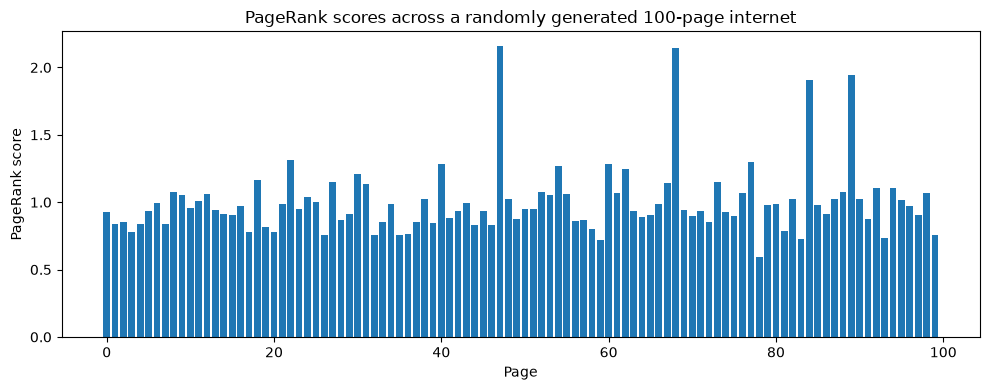

# PageRank via Power Iteration

An implementation of Google's original PageRank algorithm from scratch in Python.

## About

PageRank models the internet as a graph of pages linked to one another.
The algorithm simulates a "random surfer" who clicks through links,
occasionally jumping to a random page instead of following a link.
Pages the surfer visits more often end up ranked higher.

Mathematically, this comes down to finding the **dominant eigenvector**
of the page-link matrix — a vector that keeps its direction under
matrix multiplication, only getting scaled. This eigenvector represents
the long-run, stable distribution of "surfer attention" across pages.

Rather than computing this eigenvector directly (computationally
expensive for large matrices), this implementation uses **power
iteration**: repeatedly multiplying the matrix by a vector until
the result stabilises. This scales far better to real-world systems
with millions of pages.

A **damping factor** is also applied — the probability of randomly
jumping to any page instead of following a link. This solves two
issues that arise in real link graphs: closed loops (pages linking
in a cycle with no exit) and disconnected clusters of pages that
would otherwise have no well-defined ranking.

## Example

Ranking a randomly generated 100-page "internet":



## Usage

```python
from pagerank import generate_internet, page_rank

# Build a toy internet and rank its pages
internet = generate_internet(100, seed=42)
scores = page_rank(internet, d=0.9)
```

## Files

- `pagerank.py` — core implementation (`generate_internet`, `page_rank`)
- `PageRank.ipynb` — notebook walkthrough with the demo and plot

## Background

Built while studying [Mathematics for Machine Learning: Linear Algebra](https://www.coursera.org/learn/linear-algebra-machine-learning) (Imperial College London), applying the eigenvalues/eigenvectors module to a real algorithm.
